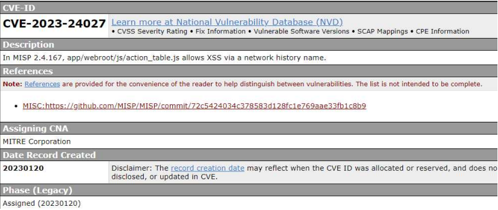
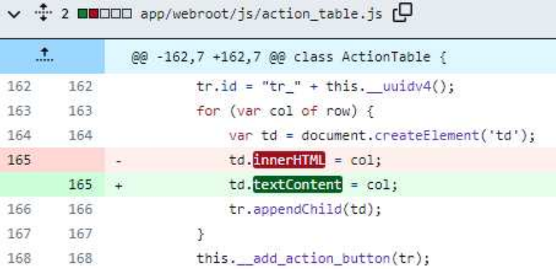

# XSS Vulnerability Fix Report: HTML Escaping in Advanced Finance Tracker

## 1. Introduction

Cross-Site Scripting (XSS) remains one of the most prevalent web security vulnerabilities, ranking second in the CWE Top 25 list for 2022 [1]. This report documents the XSS vulnerability fix implemented in the **Advanced Finance Tracker** project, a personal finance management application built with vanilla JavaScript. The fix introduces an `escapeHtml` function that sanitizes user-generated content before rendering it in the DOM, effectively preventing stored XSS attacks.

---

## Section 2: Deficiency Analysis

### 2.1 Detection

The XSS vulnerability was identified through manual code review. The `renderTransactionItem` function in `main.js` (line 467) constructs HTML via template literals that interpolate user-supplied data — `tx.title` and `tx.category` — directly into the DOM through `innerHTML`. An attacker can inject `` as a transaction title. When rendered, the browser parses the `` tag and executes the `onerror` handler — a classic **Stored XSS** attack. No sanitization was present at any rendering point.

### 2.2 Literature

Two sources guided the remediation. **Tang et al. [1]** identify XSS root cause as the browser's inability to distinguish legitimate code from injected code. Their paper demonstrates (Section III-B, Fig. 4–5) that replacing `innerHTML` with `textContent` — or equivalently, escaping HTML entities before DOM insertion — prevents the browser from parsing special symbols in tags, neutralizing malicious code. This is illustrated through MISP vulnerability CVE-2023-24027, where the fix replaced `innerHTML` with `textContent` on line 165 of `action_table.js`. **Cloudflare's** XSS prevention documentation [2] reinforces this, emphasizing that **character escaping** — converting `<`, `>`, `&`, `"`, and `'` to HTML entities — is a foundational defense. Both sources agree: treat all user data as untrusted text, not executable code.

### 2.3 Implementation

Guided by the literature, the fix introduces an `escapeHtml` function that sanitizes user data at render time:

```javascript
const escapeHtml = (str) =>
  String(str)
    .replace(/&/g, "&")
    .replace(/</g, "<")
    .replace(/>/g, ">")
    .replace(/"/g, """)
    .replace(/'/g, "&#039;");
```

The function is applied at every DOM insertion point. In `renderTransactionItem`, the title and category are wrapped: `const safeTitle = escapeHtml(tx.title)`. Month-group labels in `renderTransactions` are similarly sanitized. The fix exists in both `main.js` (lines 8–14) and `utils.js` (lines 4–10).

**Before vs. After code comparison:**

| Aspect | Before (Vulnerable) | After (Protected) |
|--------|-------------------|-------------------|
| Rendering | `` <p>${tx.title}</p> `` | `` <p>${escapeHtml(tx.title)}</p> `` |
| Input | `` | `` |
| Output | Image rendered, script executes | `` as text |

The fix is tested in `main.test.js` (lines 27–61) with 8 test cases covering `< >` escaping, ampersand, quotes, XSS payloads, null/number coercion, and safe strings. This aligns with Tang et al.'s defense-in-depth principle [1] and Cloudflare's best practices [2].

---

## 3. References

1. **Tang, C., Wang, Q., Cheng, G., Liang, H., Peng, J., Yang, M., Liu, W., Liu, M., & Sha, L.** (2024). *A Cross-Site Scripting Attack Protection Framework Based on Managed Proxy*. 2024 IEEE 23rd International Conference on Trust, Security and Privacy in Computing and Communications (TrustCom), pp. 1896–1903. DOI: 10.1109/TrustCom63139.2024.00262.

2. **Cloudflare.** *How to prevent XSS attacks*. Available at: https://www.cloudflare.com/learning/security/how-to-prevent-xss-attacks/

---

## Appendix: Supporting Figures

**Figure 1: MISP Vulnerability Disclosure (CVE-2023-24027)** — Tang et al. [1] Fig. 4



*This figure from Tang et al. [1] shows the MISP vulnerability CVE-2023-24027, where `innerHTML` renders user-controlled data (network address names), creating an XSS vector. This mirrors the vulnerability found in our application before the fix.*

**Figure 2: MISP Vulnerability Fix** — Tang et al. [1] Fig. 5



*This figure illustrates the fix: replacing `innerHTML` with `textContent` on line 165 of `action_table.js`, preventing the browser from parsing special symbols in tags. Our `escapeHtml` function achieves the same protective effect by encoding HTML entities before DOM insertion.*
